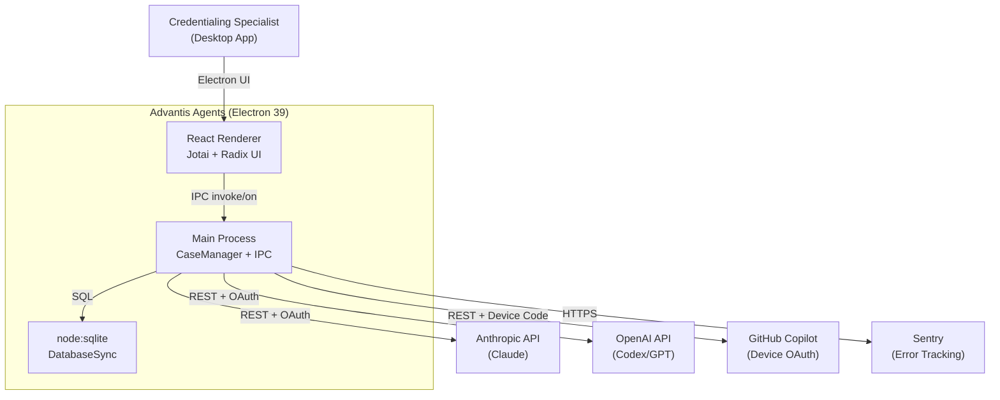
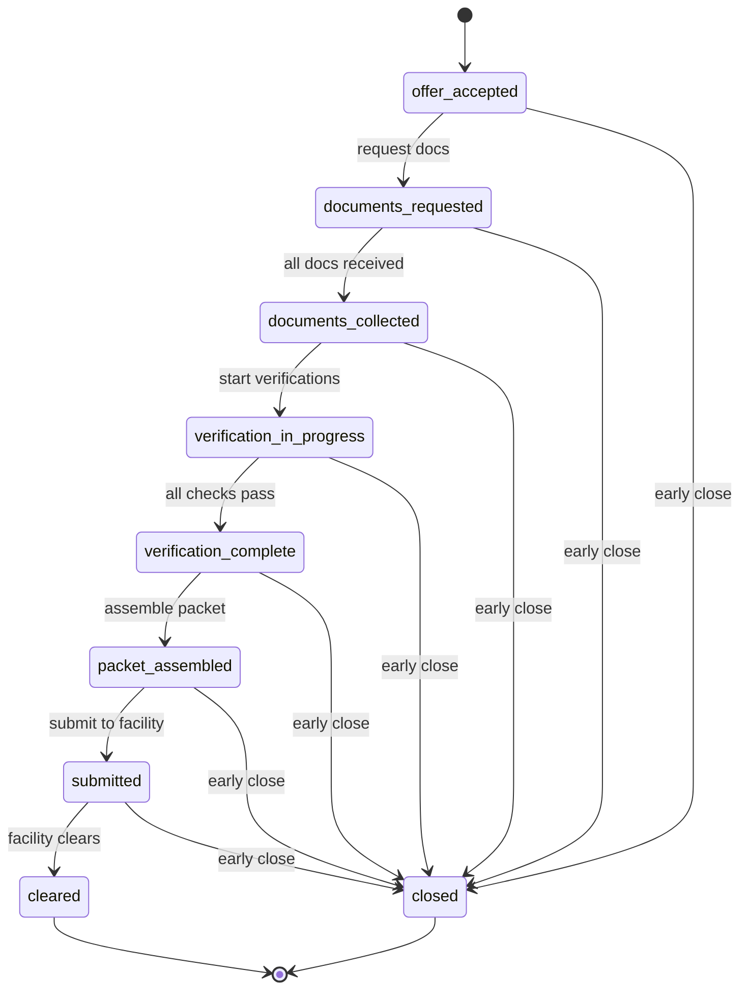
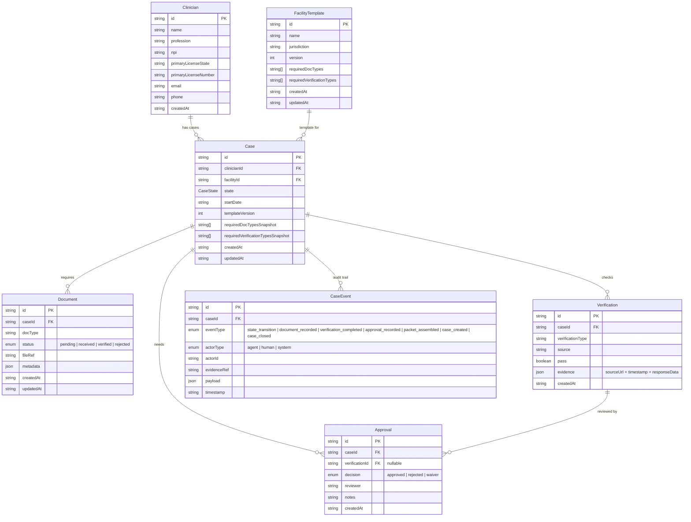
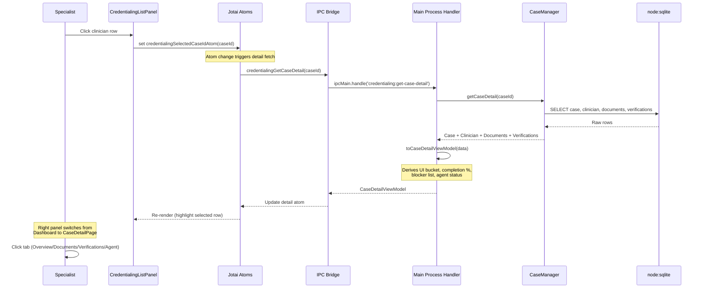
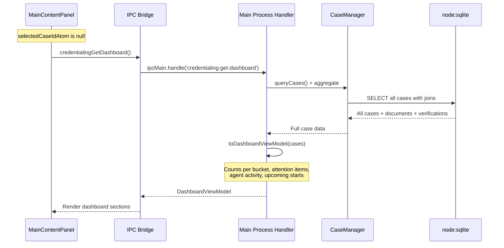
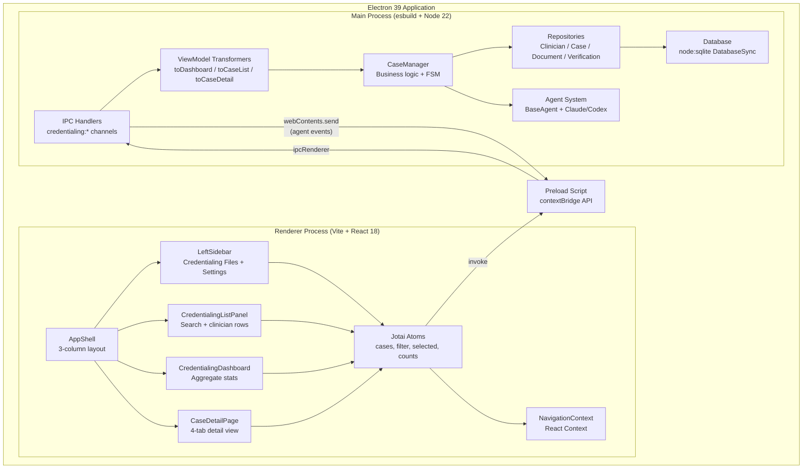

# Credentialing UI - State Maps & Architecture Diagrams

**Last updated:** 2026-02-24
**Source of truth:** `.docs/credentialing-ui/SHAPING.md`, `packages/credentialing/src/`

---

## 1. System Context

What Advantis Agents talks to and how.



**Notes:**
- Verification sources (NPPES, OIG, SAM.gov) are MCP-tool-dispatched, not hardcoded
- OAuth flows: Claude Max (browser redirect), ChatGPT (token), Copilot (device code)
- DB is local-only, no server sync

---

## 2. Case State Machine

The credentialing FSM from `packages/credentialing/src/state-machine.ts`.
9 states, linear happy path, any non-terminal state can exit to `closed`.



### UI Status Bucket Derivation

FSM states map to UI display buckets via `deriveUiStatusBucket()`.
These are ViewModel-layer derivations, never stored in DB.

```
FSM State                    + Conditions               = UI Bucket
---------------------------------------------------------------------
cleared                                                   Cleared
any non-terminal             + adverse findings           Blocked
any non-terminal             + missing items + <=14 days  At Risk
verification_complete        + no blockers                Pending Submission
packet_assembled             + no blockers                Pending Submission
submitted                                                 With Facility
offer_accepted               + no risk/blocker flags      Active
documents_requested          + no risk/blocker flags      Active
documents_collected          + no risk/blocker flags      Active
verification_in_progress     + no risk/blocker flags      Active
```

**Priority order (sort + sidebar):**

```
At Risk = 0  >  Blocked = 1  >  Pending Submission = 2
  >  With Facility = 3  >  Active = 4  >  Cleared = 5
```

---

## 3. Data Model (ERD)

All entities from `packages/credentialing/src/types.ts`.



**Key relationships:**
- `Clinician` 1:many `Case` (one clinician per facility assignment)
- `FacilityTemplate` 1:many `Case` (template snapshots into case at creation)
- `Case` 1:many `Document`, `Verification`, `Approval`, `CaseEvent`
- `Verification` 0..1:many `Approval` (adverse findings need human review)

---

## 4. Sequence Diagram: Case Selection Flow

The critical user flow: specialist clicks a clinician in the list,
app loads detail from DB via IPC, renders 4-tab view.



### Dashboard Load (No Selection)



---

## 5. Component Architecture

Internal components of Advantis Agents and how they communicate.



### IPC Channel Map

Existing credentialing channels (registered in `ipc.ts`):

```
Channel                              Direction    Handler
---------------------------------------------------------------
credentialing:query-cases            invoke       CaseManager (tool)
credentialing:create-case            invoke       CaseManager (tool)
credentialing:get-case-timeline      invoke       CaseManager (tool)
credentialing:run-verification       invoke       CaseManager (tool)
credentialing:transition-state       invoke       CaseManager (tool)
credentialing:check-guards           invoke       CaseManager (tool)
credentialing:get-finding-detail     invoke       CaseManager (tool)
credentialing:record-approval        invoke       CaseManager (tool)
credentialing:query-templates        invoke       CaseManager (tool)
credentialing:create-template        invoke       CaseManager (tool)
credentialing:update-template        invoke       CaseManager (tool)
credentialing:spawn-agent            invoke       CaseManager (direct)
credentialing:get-active-agent       invoke       CaseManager (direct)
credentialing:list-case-agents       invoke       CaseManager (direct)
```

New ViewModel channels (added in this feature):

```
Channel                              Direction    Handler
---------------------------------------------------------------
credentialing:get-dashboard          invoke       toDashboardViewModel()
credentialing:get-case-list          invoke       toCaseListViewModel()
credentialing:get-case-detail        invoke       toCaseDetailViewModel()
```

---

## Seed Data Reference

5 clinicians mapping FSM states to UI buckets:

```
Clinician              FSM State                  UI Bucket            Why
---------------------------------------------------------------------------------------
Jane Doe               documents_requested        At Risk              Missing TB, 5d
  ICU RN, Memorial TX
John Smith             verification_in_progress   Blocked              Adverse finding
  Med-Surg RN, Memorial TX
Sarah Johnson          packet_assembled           Pending Submission   All green
  ED RN, St. Mary's CA
Mike Brown             submitted                  With Facility        Awaiting clearance
  ICU RN, Cedar Sinai CA
Amy Chen               verification_in_progress   Active               On track
  Telemetry RN, Houston Med TX
```

---

## Diagram Maintenance

- **Update when:** Entity schema changes, FSM transitions change, new IPC channels added
- **Source files to watch:** `types.ts`, `state-machine.ts`, `ipc.ts`, `case-manager.ts`
- **Rendering:** All Mermaid diagrams render natively on GitHub. For local preview use VS Code Mermaid extension or `mermaid.live`
- **Scope:** Only diagram what's complex or ambiguous. Don't diagram trivial components.
